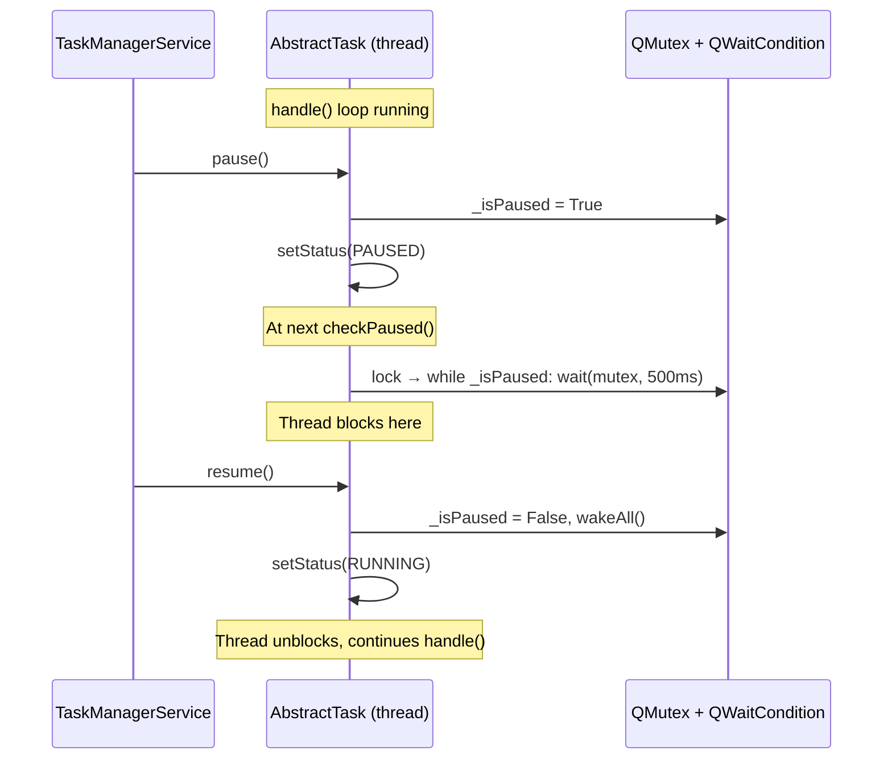

# Pause/Resume, Auto-Retry Fix, and TaskQueue.loadState

## Overview

This document describes three changes to the TaskSystem:

1. **Pause/Resume** — Add `QMutex`/`QWaitCondition`-based pause gate to `AbstractTask`
2. **Auto-Retry bugfix** — Fix duplicate signal connections and missing status signals in retry flow
3. **TaskQueue.loadState()** — Implement pending task restoration from storage

## 1. Pause/Resume Architecture

### Mechanism

`AbstractTask` gets a new pause gate using Qt's `QMutex` + `QWaitCondition`:

### Key Properties

| Property | Value |
|----------|-------|
| Blocking method | `QWaitCondition.wait(mutex, timeoutMs)` |
| Default check interval | 500ms (configurable via `_pauseCheckIntervalMs`) |
| Executor slot | Task **stays** in `_runningTasks` while paused |
| Cancel while paused | `cancel()` sets `_isPaused = False` + `wakeAll()` so thread can exit |

### Contract for Subclasses

Subclass `handle()` methods **must** call `self.checkPaused()` periodically for pause to take effect.
Tasks without `checkPaused()` calls will effectively ignore pause requests.

## 2. Auto-Retry Bugfix

### Bugs

1. `_retryTask` uses `task.status = PENDING` (no signal) instead of `task.setStatus(PENDING)`
2. `_processQueue` reconnects `taskFinished` each retry → N duplicate handlers
3. `_retryTask` → `addTask` → `_taskTracker.addTask` skips silently (already tracked)

### Fix Summary

- Disconnect `taskFinished` in `_handleTaskCompletion` when popping from `_runningTasks`
- `_retryTask` re-enqueues directly to `_pendingTasks` (skip tracker since already tracked)
- Use `setStatus()` for status changes

## 3. TaskQueue.loadState()

Mirrors `TaskScheduler._loadJobs`: dynamic class import via `className` → `__import__` → `deserialize()`.
Only persistent tasks are saved/loaded.
