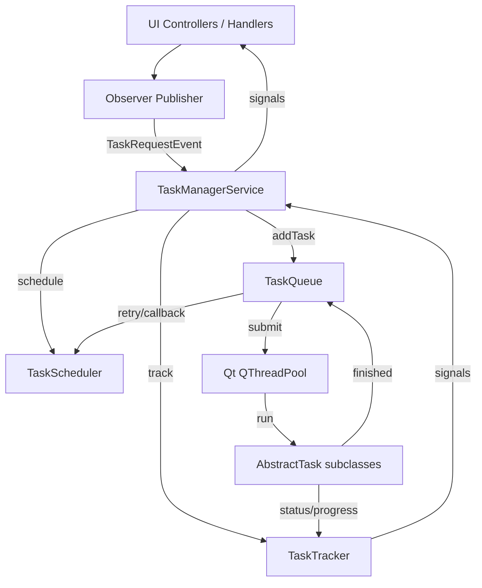

## Objective

- Adopt the redesigned TaskSystem architecture as the single source of truth for all automation workflows.
- Align legacy task producers/consumers with `TaskManagerService`, `TaskQueue`, `TaskScheduler`, and `TaskTracker`.
- Ensure documentation, testing, and logging policies remain consistent with the Qt naming guidelines.

## References

- [Task System Plan (Oct 2025)](mdc:core/taskSystem/docs/task-system-plan-oct-2025.md)
- [Task System Migration Summary](mdc:core/taskSystem/docs/task-system-migration.md)
- [Task System API Documentation](mdc:core/taskSystem/docs/task-system-api.md)
- [Architecture Guide](mdc:core/taskSystem/docs/architecture.md)
- [Testing Guide](mdc:core/taskSystem/docs/testing.md)

## Current State Summary

- Legacy orchestration has been replaced by `TaskManagerService` coordinating queue, tracker, and scheduler.
- Task definitions inherit `AbstractTask` with Qt signals, serialization, and retry metadata.
- APScheduler persists serialized tasks; deserialization restores runnable tasks at trigger time.
- UI and handlers interact through Observer events rather than direct controller calls.
- Logger usage is standardized via `logger.bind(component="TaskSystem")`.

## Integration Diagram

## Integration Checklist

1. **Inventory existing tasks**
   - Locate all legacy task implementations and ensure they subclass `AbstractTask`.
   - Confirm serialization/deserialization coverage for persistent scheduling.
2. **Consolidate task orchestration**
   - Replace direct queue usage with `TaskManagerService.addTask(...)`.
   - Route task-related Observer events through `onTaskRequestEvent`.
3. **Scheduler alignment**
   - Migrate ad-hoc timers to `TaskScheduler.addScheduledTask` with serialized payloads.
   - Validate job store configuration via `core.Config` (`taskSystem.jobStorePath`).
4. **Tracker synchronization**
   - Ensure tasks emit `statusChanged`, `progressUpdated`, `taskFinished`.
   - Subscribe UI dashboards to `TaskManagerService` signals instead of polling.
5. **Logging policy**
   - Audit modules for `logger.bind(component="TaskSystem")`.
   - Inject contextual identifiers (`taskUuid`, `threadId`) in async flows.
6. **Persistence**
   - Verify `TaskQueue.saveState()` and `TaskTracker.saveState()` execute on shutdown hooks.
   - Ensure tasks requiring restart survival set `isPersistent=True`.
7. **Documentation updates**
   - Link new modules back to the Architecture and API docs after integration.
   - Record deviations or module-specific notes in `docs/`.

## Testing Strategy

- Follow the [Testing Guide](mdc:core/taskSystem/docs/testing.md) to run pytest suites via `scripts/run_pytest.py`.
- Add scenario coverage for:
  - Immediate queue execution (`tests_auto/task_system/test_TaskQueue.py`).
  - Scheduler triggers with MemoryJobStore mocks.
  - TaskTracker persistence and failed task history.
  - Observer-driven end-to-end flows (integration tests).
- Use fixtures to simulate Qt signals and Config interactions.

## Risks & Mitigations

- **Serialization drift**: enforce schema validation in `deserialize` methods; add regression tests.
- **Signal wiring regressions**: leverage `qtbot.waitSignal` during tests to catch missed emissions.
- **Scheduler persistence issues**: sandbox APScheduler migrations in staging with in-memory job stores.
- **Thread contention**: monitor QThreadPool usage and adjust `maxConcurrentTasks` through configuration.

