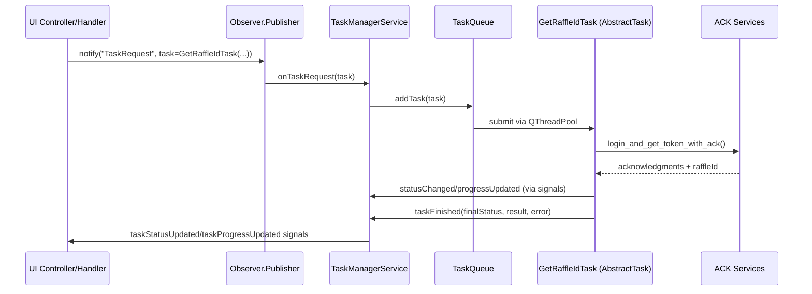

## Task 017 – Legacy Workflow Migration Plan

### Objective

- Migrate the `GetRaffleId` automation flow and its scheduler/UI touch points from the legacy `core.task` stack to the new `core.taskSystem` architecture.
- Ensure all entry points enqueue tasks through `TaskManagerService` and rely on `AbstractTask` subclasses with proper serialization, retry, and logging semantics.
- Retire direct usage of `core.TaskManager`, `tasks.GetRaffleIdTask`, and `PersistentTaskSchedulerService` while preserving existing ACK-based browser automation behavior.

### Current State Snapshot

| Concern | Legacy Implementation | Notes |
| --- | --- | --- |
| Task Definition | `tasks/GetRaffleIdTask.py` inheriting `core.Task` | Encodes ACK workflow, emits Qt signals via `task.signals`, manual `cleanup` |
| Task Queueing | `TaskManager` in `windows/main/MainController` | Direct thread pool management; no `AbstractTask` support |
| Scheduling | `services/PersistentTaskSchedulerService` + JSON store | Manually persists task objects/metadata, invokes `TaskManager.runTask()` |
| UI Binding | `TaskSelectorWidget` imports `tasks` module (`__all__`) | Enumerates legacy task classes, constructs instances directly |
| Observer Events | `Publisher().notify('uiLog', ...)` only | No `TaskRequest` emission for TaskSystem |

### Target State

- `services/tasks/GetRaffleIdTask.py` defines an `AbstractTask` subclass (`GetRaffleIdTask`) encapsulating ACK orchestration, progress updates via `setProgress`, and structured serialization.
- `TaskManagerService` instantiated during app startup and exposed through a thin facade for UI consumption (`QtAppContext` entry).
- UI controllers/handlers dispatch `TaskRequest` events (with task instances or factories) instead of instantiating/queuing legacy tasks.
- Scheduling handled via `TaskManagerService.addTask(..., scheduleInfo)` leveraging `TaskScheduler` (APScheduler). Persistent metadata stored through TaskSystem persistence (Config-backed).
- `PersistentTaskSchedulerService` retired or reduced to a compatibility adapter delegating to `TaskScheduler`.

### Impacted Modules

- `tasks/GetRaffleIdTask.py` (replace with service-layer AbstractTask)
- `tasks/__init__.py` (update exports / compatibility shim)
- `services/PersistentTaskSchedulerService.py` (refactor into TaskSystem adapter or remove usage)
- `services/TaskSchedulerService.py` (retire legacy scheduler loop)
- `windows/main/MainController.py` (bootstrap TaskManagerService, subscribe to TaskSystem signals, update UI tables)
- `windows/components/TaskSelector/*` (enumerate new task registry from `services.tasks`)
- `helpers/AppHelper` / `QtAppContext` (ensure TaskManagerService registered)
- `docs/` updates (API, scheduler adjustments, migration notes)
- `tests_core/` (new fixtures/tests for TaskSystem flows)

### Implementation Steps

1. **Introduce Task Registry**
   - Create `services/tasks/__init__.py` exporting task factories keyed by PascalCase names.
   - Register `GetRaffleIdTask` (new AbstractTask subclass) and provide helper for serialization (`TASK_CATALOG`).
   - Maintain compatibility shim in `tasks/__init__.py` that proxies to new registry during transition.

2. **Port GetRaffleIdTask**
   - Refactor logic into `services/tasks/GetRaffleIdTask.py` inheriting `AbstractTask`.
   - Replace `signals.progress.emit` with `setProgress`, `statusChanged`, `taskFinished` semantics.
   - Ensure ACK tracker lifecycle handled in `handle()` and `_performCancellationCleanup()`.
   - Implement `serialize()`/`deserialize()` round-trip capturing account identifiers, raffle schedule id, persisted state.
   - Bind logger with `logger.bind(component="TaskSystem", taskUuid=self.uuid)`.

3. **Bridge Legacy Entrypoints**
   - Add `TaskSystemFacade` (e.g., `services/tasks/TaskSystemBridge.py`) exposing helper methods to enqueue tasks (`enqueueTask`, `scheduleTask`) that wrap `Publisher().notify('TaskRequest', ...)`.
   - Update UI handlers (MainController, TaskSelectorWidget) to use the facade instead of instantiating tasks directly.

4. **Refactor Scheduler Integration**
   - Replace `PersistentTaskSchedulerService` usage with TaskSystem facade:
     - `add_schedule` → `TaskManagerService.addTask` with `scheduleInfo`.
     - Persist metadata via TaskSystem (remove manual JSON file writes).
     - Provide migration routine to import legacy `schedules.json` once into TaskSystem, then deprecate file.
   - Update UI schedule table bindings to read from `TaskManagerService.getScheduledJobs()`.

5. **UI Updates**
   - Inject `TaskManagerService` into `QtAppContext` during bootstrap (`main.py`).
   - Subscribe UI components to `taskAdded`, `taskStatusUpdated`, `taskProgressUpdated`, `failedTaskLogged`.
   - Remove manual progress tracking dictionary and rely on TaskTracker data exposed by TaskSystem.
   - Update TaskSelector to read from new registry (CamelCase names, friendly display).

6. **Persistence & Cleanup**
   - Ensure `TaskManagerService.saveState()` invoked on shutdown (replacing `scheduler_service.stop()`).
   - Remove `core.TaskManager` instantiation and ensure no leftover direct thread pool usage.
   - Delete/retire legacy scheduler files after migration if redundant.

7. **Testing & Validation**
   - Add pytest coverage for `GetRaffleIdTask` serialization/deserialization, ACK workflow (mock `VndAuthService`/`VndAutomationService`).
   - Integration tests verifying `TaskManagerService` receives `TaskRequest` and task reaches completion.
   - UI smoke tests (Qt bot) ensuring TaskSelector lists new task and schedule table renders TaskSystem job metadata.

### Sequence Overview

### Risks & Mitigations

- **Legacy Schedule Data**: Provide migration script or one-time import to avoid losing existing schedules.
- **ACK Lifecycle**: Ensure cancellation cleanup still stops handler services to prevent orphaned threads.
- **UI Regression**: Stage UI refactor carefully; use feature toggle if needed during transition.
- **Thread Context Logs**: Bind `threadId` or `taskUuid` to TaskSystem logger to maintain traceability.

### Validation Checklist

- [ ] No remaining imports from `core.Task` or `core.TaskManager` in active modules.
- [ ] `TaskSelectorWidget` enumerates tasks from `services.tasks`.
- [ ] `PersistentTaskSchedulerService` either removed or solely delegates to TaskSystem scheduler.
- [ ] `GetRaffleIdTask` persists state via `serialize()` and resurrects via `deserialize()`.
- [ ] Pytest suite includes new TaskSystem tests and passes locally.
- [ ] Documentation (`docs/persistent-scheduler-adjustments.md`, `docs/task-system-api.md`) updated with new instructions.

