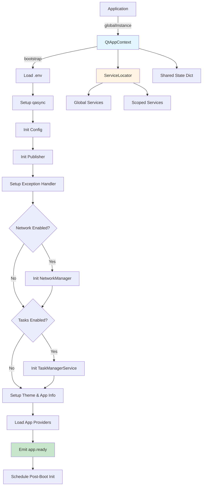

# QtAppContext - Application Lifecycle Manager

> **Central orchestrator for application context, services, and lifecycle management**

## Overview

`QtAppContext` is a singleton that manages the entire application lifecycle, from bootstrap to shutdown. It provides:

- Feature flags (enable/disable components via environment variables)
- Service registry (global services)
- Scoped resource management (task-specific cleanup)
- Application state management
- Qt event loop integration

## API Reference

### Singleton Access

```python
from core import QtAppContext

ctx = QtAppContext.globalInstance()  # Thread-safe singleton
```

### Bootstrap

```python
ctx.bootstrap()  # Idempotent - runs only once
```

**Bootstrap process:**

1. Load `.env` file (if `python-dotenv` is available)
2. Setup async event loop (`qasync`)
3. Initialize `Config` & `Publisher` singletons
4. Setup global exception handler
5. Conditionally initialize `NetworkManager` & `TaskManagerService` (if enabled)
6. Setup Theme, App Name & Icon
7. **Load App Providers** (execute `_loadAppProviders` for the ServiceProviders manifest)
8. Emit `app.ready` event
9. **Schedule Post-Boot Init** (e.g., defer `TaskManagerService.booted()` to the next event loop tick)

### Feature Flags

```python
# Check if feature enabled
if ctx.isFeatureEnabled('network'):
    network = ctx.network

if ctx.isFeatureEnabled('tasks'):
    taskManager = ctx.taskManager
```

**Environment variables:**

```bash
# .env file
PSA_ENABLE_NETWORK=true   # Default: true
PSA_ENABLE_TASKS=true     # Default: true
```

**Parsing rules:**

- `true`, `1`, `yes`, `on` → `True`
- `false`, `0`, `no`, `off` → `False`
- Missing → Default value

### Core Services

```python
# Always available
config = ctx.config          # Config singleton
publisher = ctx.publisher    # Publisher singleton

# Conditional (check feature flags first)
network = ctx.network        # QNetworkAccessManager | None
taskManager = ctx.taskManager  # TaskManagerService | None
```

### Service Registration

**Global services:**

```python
# Register
myService = MyService()
ctx.registerService('my_service', myService)

# Retrieve
myService = ctx.getService('my_service')
```

**Scoped services:**

```python
# Register with tag (usually task UUID)
taskId = str(uuid.uuid4())
browser = ChromeBrowserService()
ctx.registerScopedService(taskId, browser)

# Retrieve typed scoped service
browser = ctx.getScopedServiceByType(taskId, ChromeBrowserService)

# Cleanup all services under tag
ctx.releaseScope(taskId)  # Calls cleanup()/close()/dispose()
```

### State Management

```python
# Set shared state
ctx.setState('current_user', {'id': 123, 'name': 'John'})

# Get shared state
user = ctx.getState('current_user')
user = ctx.getState('missing_key', default={'id': 0})
```

**Thread-safe:** Uses `QMutex` internally.

### SharedCollection

`SharedCollection` là dạng Shared State đặc biệt dành cho collection.  
Thread-safe và cung cấp fluent interface với helper methods lấy cảm hứng từ LINQ (C#).

```python
# Lấy (hoặc tự động tạo mới) collection theo key
col = ctx.getCollection('activeTasks')

# Fluent mutation
col.add(task).add(task2)
col.addMany([t1, t2, t3])
col.remove(task)
col.removeWhere(lambda t: t.status == 'done')
col.update(lambda t: t.id == target_id, lambda t: setattr(t, 'progress', 100))
col.replace([newTask1, newTask2])
col.clear()

# LINQ-style query (snapshot-based — safe to call from any thread)
active     = col.where(lambda t: t.isActive)
names      = col.select(lambda t: t.name)
first      = col.first(lambda t: t.priority > 5)
last       = col.last()
hasAny     = col.any(lambda t: t.failed)
allDone    = col.all(lambda t: t.done)
total      = col.count()
failCount  = col.count(lambda t: t.failed)
byStatus   = col.groupBy(lambda t: t.status)   # -> dict[str, list[Task]]
sorted_    = col.orderBy(lambda t: t.createdAt)
unique     = col.distinct(keyFn=lambda t: t.id)
snapshot   = col.toList()                       # plain list copy

# Dunder helpers
len(col)
task in col
for t in col: ...   # iterates over snapshot

# Management
ctx.hasCollection('activeTasks')  # -> bool
ctx.removeCollection('activeTasks')
```

**Thread-safety model:**
- Mutation methods giữ `QMutex` trong suốt thời gian thay đổi.
- Query methods copy snapshot → release lock → gọi predicate/mapper của user, tránh deadlock.

### Lifecycle Signals

```python
# Connect to lifecycle signals
ctx.appBooting.connect(onAppBooting)
ctx.appReady.connect(onAppReady)
ctx.appClosing.connect(onAppClosing)
```

### Main Window Access

```python
# Returns the MainController instance (the top-level main window) or None if not found
mainWindowCtl = ctx.getMainWindowCtl()
```

### Run Event Loop

```python
exitCode = ctx.run()  # Blocks until app quits
```

**Note:** Automatically calls `bootstrap()` if not already done.

## Usage Examples

### Basic Application

```python
from core import QtAppContext
from app.windows.main import MainWindow

def main():
    # 1. Get context
    ctx = QtAppContext.globalInstance()
    
    # 2. Bootstrap
    ctx.bootstrap()
    
    # 3. Create main window
    mainWindow = MainWindow()
    mainWindow.show()
    
    # 4. Run event loop
    return ctx.run()

if __name__ == '__main__':
    import sys
    sys.exit(main())
```

### With Custom Services

```python
from core import QtAppContext

class DatabaseService:
    def __init__(self, config):
        self.config = config
        self.connection = None
    
    def connect(self):
        # Connect to database
        pass

def main():
    ctx = QtAppContext.globalInstance()
    ctx.bootstrap()
    
    # Register custom service
    dbService = DatabaseService(ctx.config)
    ctx.registerService('database', dbService)
    dbService.connect()
    
    # Access from anywhere
    db = ctx.getService('database')
    
    return ctx.run()
```

### Scoped Resources in Task

```python
from core import QtAppContext
from core.taskSystem import AbstractTask

class BrowserAutomationTask(AbstractTask):
    def handle(self):
        ctx = QtAppContext.globalInstance()
        taskId = self.uuid
        
        # Create scoped resources
        browser = ChromeBrowserService()
        tempFiles = TempFileHandler()
        
        # Register for auto cleanup
        ctx.registerScopedService(taskId, browser)
        ctx.registerScopedService(taskId, tempFiles)
        
        try:
            # Use resources
            browser.navigate('https://example.com')
            tempFiles.createTemp('data.json')
            
            # Do work...
            if self.isStopped():
                return
            
        finally:
            # Auto cleanup: calls browser.cleanup() and tempFiles.cleanup()
            ctx.releaseScope(taskId)
```

### Feature Flag Usage

```python
from core import QtAppContext

ctx = QtAppContext.globalInstance()
ctx.bootstrap()

# Check before using
if ctx.isFeatureEnabled('network'):
    from PySide6.QtNetwork import QNetworkRequest
    from PySide6.QtCore import QUrl
    
    request = QNetworkRequest(QUrl('https://api.example.com'))
    reply = ctx.network.get(request)
else:
    # Fallback: use requests library
    import requests
    response = requests.get('https://api.example.com')
```

### Lifecycle Hooks

```python
from core import QtAppContext
from core.Logging import logger

def onAppBooting():
    logger.info('Application is booting...')

def onAppReady():
    logger.info('Application is ready!')
    # Initialize UI, load data, etc.

def onAppClosing():
    logger.info('Application is closing...')
    # Save state, cleanup resources

ctx = QtAppContext.globalInstance()
ctx.appBooting.connect(onAppBooting)
ctx.appReady.connect(onAppReady)
ctx.appClosing.connect(onAppClosing)

ctx.bootstrap()
ctx.run()
```

## Architecture



## Best Practices

### ✅ DO

```python
# Use singleton instance
ctx = QtAppContext.globalInstance()

# Bootstrap before accessing services
ctx.bootstrap()

# Check feature flags before using optional services
if ctx.isFeatureEnabled('network'):
    network = ctx.network

# Use scoped services for task-specific resources
ctx.registerScopedService(taskId, resource)
try:
    # Use resource
    pass
finally:
    ctx.releaseScope(taskId)

# Register global services during bootstrap
ctx.bootstrap()
myService = MyService()
ctx.registerService('my_service', myService)
```

### ❌ DON'T

```python
# Don't create multiple instances
ctx1 = QtAppContext()  # Wrong! Use globalInstance()

# Don't access services before bootstrap
ctx = QtAppContext.globalInstance()
config = ctx.config  # Wrong! Bootstrap first

# Don't use NetworkManager in background threads
def background_task():
    ctx = QtAppContext.globalInstance()
    network = ctx.network  # Wrong! UI thread only
    # Use requests library instead

# Don't forget to release scoped services
ctx.registerScopedService(taskId, browser)
# ... use browser ...
# Missing: ctx.releaseScope(taskId)  # Memory leak!

# Don't register services before bootstrap
ctx = QtAppContext.globalInstance()
ctx.registerService('my_service', MyService())  # Wrong order
ctx.bootstrap()
```

## Thread Safety

- ✅ `globalInstance()`: Thread-safe (QMutex)
- ✅ `bootstrap()`: Thread-safe, idempotent
- ✅ `setState()`/`getState()`: Thread-safe (QMutex)
- ✅ Service registration: Thread-safe (delegated to ServiceLocator)
- ⚠️ `network`: UI thread only (QNetworkAccessManager limitation)

## Common Patterns

### Application Entry Point

```python
# main.py
from core import QtAppContext
from app.windows.main import MainWindow

def main():
    ctx = QtAppContext.globalInstance()
    ctx.bootstrap()
    
    mainWindow = MainWindow()
    mainWindow.show()
    
    return ctx.run()

if __name__ == '__main__':
    import sys
    sys.exit(main())
```

### Service Access Pattern

```python
# Anywhere in application
from core import QtAppContext

ctx = QtAppContext.globalInstance()
config = ctx.config
publisher = ctx.publisher
myService = ctx.getService('my_service')
```

### Task Scoping Pattern

```python
class MyTask(AbstractTask):
    def handle(self):
        ctx = QtAppContext.globalInstance()
        taskId = self.uuid
        
        # Setup scoped resources
        resources = [
            ChromeBrowserService(),
            TempFileHandler(),
            ApiSession()
        ]
        
        for resource in resources:
            ctx.registerScopedService(taskId, resource)
        
        try:
            # Task logic
            pass
        finally:
            ctx.releaseScope(taskId)
```

## Related Documentation

- [ServiceLocator](02-dependency-injection.md) - DI container details
- [ServiceProvider](25-service-providers.md) - Service provider architecture
- [Config](06-configuration.md) - Configuration management
- [Publisher](03-observer-pattern.md) - Event system
- [NetworkManager](08-network-manager.md) - Network integration
- [TaskManagerService](15-task-manager.md) - Task system

## Troubleshooting

**Q: Services are None after bootstrap**

```python
# Check feature flags
ctx = QtAppContext.globalInstance()
ctx.bootstrap()

if ctx.network is None:
    # Check PSA_ENABLE_NETWORK in .env
    print(ctx.isFeatureEnabled('network'))
```

**Q: Bootstrap called multiple times**

```python
# Safe - idempotent
ctx.bootstrap()
ctx.bootstrap()  # Logs warning, does nothing
```

**Q: Scoped services not cleaned up**

```python
# Ensure cleanup() method exists
class MyService:
    def cleanup(self):  # Priority 1
        # Cleanup logic
        pass
    
    def close(self):  # Priority 2 (if cleanup missing)
        pass
    
    def dispose(self):  # Priority 3 (if both missing)
        pass
```
