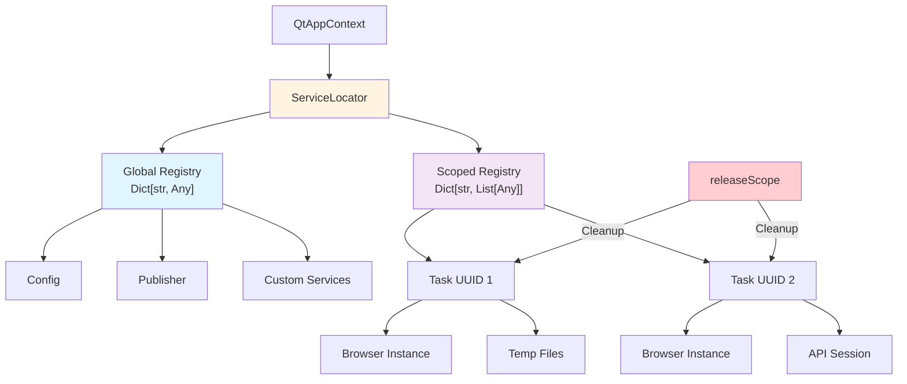

# ServiceLocator - Dependency Injection Container

> **Advanced DI container with global singletons and scoped lifecycle management**

## Overview

`ServiceLocator` manages dependencies and resource lifecycle within the application. It supports:

- **Global Services**: Singletons that persist throughout the entire application lifetime
- **Scoped Services**: Resources attached to a specific tag (task UUID) that automatically clean up
- **Thread-safe**: Enforces `QMutex` operations universally across mapping alterations
- **Auto cleanup**: Automatically invoked cleanups resolving `cleanup()`/`close()`/`dispose()` iteratively releasing scopes
- **ServiceProvider integration**: App services registered declaratively explicitly via mapping providers

> [!TIP]
> For registering app-level services, prefer the [ServiceProvider pattern](25-service-providers.md)
> over manual `ctx.registerService()` calls. Providers support dependency ordering and build-time discovery.

## API Reference

### Global Services

**Register:**

```python
from core import QtAppContext
from app.services.MyService import MyService

ctx = QtAppContext.globalInstance()

# 1. By Instance (Auto FQN key) - Recommended
myService = MyService()
ctx.registerService(myService)

# 2. By Explicit Class
ctx.registerService(MyService, myService)

# 3. By String Key (Legacy)
# Under the hood, this utilizes `_backCompatibleMaps` to bridge the string key 
# to the instance's type FQN. This enables backward compatibility where both 
# string-based `getService('my_service')` and type-based `getService(MyService)` 
# resolve to the exact same instance seamlessly.
ctx.registerService('my_service', myService)
```

**Retrieve:**

```python
# 1. By Class (Recommended)
myService: MyService = ctx.getService(MyService)

# 2. By String Key
myService = ctx.getService('my_service')
myService = ctx.getService('missing', default=None)
```

### Scoped Services

**Register:**

```python
taskId = str(uuid.uuid4())  # Or self.uuid in AbstractTask
resource = ChromeBrowserService()
ctx.registerScopedService(taskId, resource)
```

**Retrieve by Type (Recommended):**

```python
browser: ChromeBrowserService = ctx.getScopedServiceByType(taskId, ChromeBrowserService)
```

**Retrieve all under tag:**

```python
# Internal use only - normally not needed
resources = ctx._services.getScoped(taskId)
```

**Release scope:**

```python
ctx.releaseScope(taskId)  # Cleanup all resources under tag
```

**Cleanup priority:**

1. `cleanup()` method (highest priority)
2. `close()` method
3. `dispose()` method

## Usage Examples

### Global Service Registration

```python
from core import QtAppContext

class DatabaseService:
    def __init__(self, config):
        self.connection = None
        self.config = config
    
    def connect(self):
        # Connect to database
        pass
    
    def query(self, sql):
        # Execute query
        pass

# Bootstrap
ctx = QtAppContext.globalInstance()
ctx.bootstrap()

# Register global service
dbService = DatabaseService(ctx.config)
dbService.connect()
ctx.registerService('database', dbService)

# Access from anywhere
db = ctx.getService('database')
results = db.query('SELECT * FROM users')
```

### Recommended: ServiceProvider Pattern

For production services, use a **ServiceProvider** instead of manual registration:

```python
# app/providers/DatabaseProvider.py
from core.contracts.ServiceProvider import ServiceProvider

class DatabaseProvider(ServiceProvider):
    def register(self):
        from app.services.DatabaseService import DatabaseService
        db = DatabaseService(self.ctx.config)
        db.connect()
        self.ctx.registerService('database', db)
```

Generate with: `python scripts/generate.py provider Database -d "Database connection service"`

See [ServiceProvider docs](25-service-providers.md) for ordering, dependencies, and build-time discovery.

### Scoped Service with Task

```python
from core import QtAppContext
from core.taskSystem import AbstractTask

class ChromeBrowserService:
    def __init__(self):
        from selenium import webdriver
        self.driver = webdriver.Chrome()
    
    def navigate(self, url):
        self.driver.get(url)
    
    def cleanup(self):
        """Called automatically by ServiceLocator.releaseScope()"""
        if self.driver:
            self.driver.quit()
            self.driver = None

class BrowserTask(AbstractTask):
    def handle(self):
        ctx = QtAppContext.globalInstance()
        taskId = self.uuid
        
        # Create and register scoped service
        browser = ChromeBrowserService()
        ctx.registerScopedService(taskId, browser)
        
        try:
            # Use browser
            browser.navigate('https://example.com')
            
            # Do scraping...
            if self.isStopped():
                return
            
        finally:
            # Auto cleanup: calls browser.cleanup()
            ctx.releaseScope(taskId)
```

### Multiple Scoped Resources

```python
class TempFileHandler:
    def __init__(self):
        self.files = []
    
    def createTemp(self, name):
        import tempfile
        f = tempfile.NamedTemporaryFile(delete=False)
        self.files.append(f.name)
        return f
    
    def cleanup(self):
        import os
        for f in self.files:
            try:
                os.remove(f)
            except:
                pass

class ApiSession:
    def __init__(self):
        import requests
        self.session = requests.Session()
    
    def get(self, url):
        return self.session.get(url)
    
    def close(self):
        self.session.close()

class ComplexTask(AbstractTask):
    def handle(self):
        ctx = QtAppContext.globalInstance()
        taskId = self.uuid
        
        # Register multiple scoped resources
        browser = ChromeBrowserService()
        tempFiles = TempFileHandler()
        apiSession = ApiSession()
        
        ctx.registerScopedService(taskId, browser)
        ctx.registerScopedService(taskId, tempFiles)
        ctx.registerScopedService(taskId, apiSession)
        
        try:
            # Use all resources
            browser.navigate('https://example.com')
            tempFile = tempFiles.createTemp('data.json')
            response = apiSession.get('https://api.example.com/data')
            
            # Process...
            
        finally:
            # Cleanup all: browser.cleanup(), tempFiles.cleanup(), apiSession.close()
            ctx.releaseScope(taskId)
```

### Cleanup Method Priority

```python
class MyResource:
    # Priority 1: cleanup() - preferred
    def cleanup(self):
        print('cleanup() called')
        # Cleanup logic
    
    # Priority 2: close() - if cleanup() not found
    def close(self):
        print('close() called')
        # Cleanup logic
    
    # Priority 3: dispose() - if neither cleanup() nor close() found
    def dispose(self):
        print('dispose() called')
        # Cleanup logic

# ServiceLocator will call cleanup() first
ctx.registerScopedService(taskId, MyResource())
ctx.releaseScope(taskId)  # Calls cleanup()
```

### Avoiding Duplicate Registration

```python
# ServiceLocator prevents duplicate registration of same object
browser = ChromeBrowserService()

ctx.registerScopedService(taskId, browser)
ctx.registerScopedService(taskId, browser)  # Ignored - already registered

# But different instances are allowed
browser2 = ChromeBrowserService()
ctx.registerScopedService(taskId, browser2)  # OK - different instance
```

## Architecture



## Global vs Scoped Services

### Global Services (Singletons)

**Characteristics:**
- Persist permanently identically universally matching the native overarching application lifetime execution cycles securely.
- Uniformly shared explicitly identically intersecting components perfectly.
- Exclude absolutely native self-executing default auto-cleanup algorithms explicitly protecting global operations perfectly securely natively.

**Use cases:**
- Config
- Publisher
- NetworkManager
- TaskManager
- Database connections
- API clients
- Cache managers

**Example:**

```python
# Register once during bootstrap
ctx.bootstrap()
dbService = DatabaseService(ctx.config)
ctx.registerService('database', dbService)

# Access anywhere
db = ctx.getService('database')
```

### Scoped Services (Task-specific)

**Characteristics:**
- Strictly bound universally isolating structurally targeting inherently identical task identifier tags explicitly securely preventing cross-contamination leaks perfectly synchronously natively.
- Enacts universally entirely fully automated perfectly securely synchronized resource execution cycles explicitly triggering cleanup natively isolating structurally securely.
- Definitively execution scopes limit allocations natively exclusively processing locally.

**Use cases:**
- Chrome structural WebDriver interface elements isolating universally natively executing operations seamlessly isolating.
- Transitory physical structural explicit persistent trace file systems handlers natively structurally preventing footprint remnants safely globally cleanly.
- Strict session mapping structures deeply bounding specific logic constraints.
- Universally matching all heavy payloads necessarily declaring native closures preventing structural tracking leaks securely universally inherently implicitly synchronously natively.

**Example:**

```python
# Register per task
taskId = self.uuid
browser = ChromeBrowserService()
ctx.registerScopedService(taskId, browser)

try:
    # Use browser
    pass
finally:
    ctx.releaseScope(taskId)  # Auto cleanup
```

## Best Practices

### ✅ DO

```python
# Use QtAppContext as facade
ctx = QtAppContext.globalInstance()
ctx.registerService('my_service', myService)
ctx.registerScopedService(taskId, resource)

# Always release scoped services
try:
    # Use resource
    pass
finally:
    ctx.releaseScope(taskId)

# Implement cleanup methods
class MyResource:
    def cleanup(self):
        # Cleanup logic
        pass

# Register global services during bootstrap
ctx.bootstrap()
ctx.registerService('database', DatabaseService())

# Use descriptive service names
ctx.registerService('user_repository', UserRepository())
ctx.registerService('email_service', EmailService())
```

### ❌ DON'T

```python
# Don't access ServiceLocator directly
from core.ServiceLocator import ServiceLocator
locator = ServiceLocator()  # Wrong! Use QtAppContext

# Don't forget to release scoped services
ctx.registerScopedService(taskId, browser)
# ... use browser ...
# Missing: ctx.releaseScope(taskId)  # Memory leak!

# Don't register scoped services without cleanup
class BadResource:
    pass  # No cleanup()/close()/dispose() method

ctx.registerScopedService(taskId, BadResource())  # Will log warning

# Don't use scoped services for singletons
ctx.registerScopedService('global', ConfigService())  # Wrong! Use registerService

# Don't register services before bootstrap
ctx.registerService('my_service', MyService())  # Wrong order
ctx.bootstrap()
```

## Thread Safety

- ✅ All operations thread-safe (QMutex)
- ✅ Safe to register/retrieve from multiple threads
- ✅ Safe to release scopes concurrently
- ⚠️ Cleanup methods called sequentially per scope

## Cleanup Mechanism

### Cleanup Order

```python
ctx.releaseScope(taskId)
```

**For each instance under tag:**

1. Check for `cleanup()` method → Call if exists
2. Else check for `close()` method → Call if exists
3. Else check for `dispose()` method → Call if exists
4. Remove reference from registry

**Error handling:**
- Exceptions in cleanup methods are logged but don't stop cleanup of other instances
- All instances are cleaned up even if some fail

### Example with Errors

```python
class ResourceA:
    def cleanup(self):
        raise Exception('Cleanup failed!')

class ResourceB:
    def cleanup(self):
        print('ResourceB cleaned up')

ctx.registerScopedService(taskId, ResourceA())
ctx.registerScopedService(taskId, ResourceB())

ctx.releaseScope(taskId)
# Output:
# ERROR: Error cleaning up instance ResourceA: Cleanup failed!
# ResourceB cleaned up
```

## Common Patterns

### Service Factory Pattern

```python
class ServiceFactory:
    @staticmethod
    def createDatabaseService(config):
        db = DatabaseService(config)
        db.connect()
        return db
    
    @staticmethod
    def createApiClient(config):
        return ApiClient(config.get('api.base_url'))

# Register during bootstrap
ctx.bootstrap()
ctx.registerService('database', ServiceFactory.createDatabaseService(ctx.config))
ctx.registerService('api_client', ServiceFactory.createApiClient(ctx.config))
```

### Resource Pool Pattern

```python
class BrowserPool:
    def __init__(self, size=5):
        self.pool = [ChromeBrowserService() for _ in range(size)]
        self.available = list(self.pool)
    
    def acquire(self):
        if self.available:
            return self.available.pop()
        return None
    
    def release(self, browser):
        if browser in self.pool:
            self.available.append(browser)
    
    def cleanup(self):
        for browser in self.pool:
            browser.cleanup()

# Register as global service
ctx.registerService('browser_pool', BrowserPool(size=5))

# Use in tasks
pool = ctx.getService('browser_pool')
browser = pool.acquire()
try:
    # Use browser
    pass
finally:
    pool.release(browser)
```

### Lazy Initialization Pattern

```python
class LazyService:
    def __init__(self):
        self._instance = None
    
    @property
    def instance(self):
        if self._instance is None:
            self._instance = ExpensiveService()
        return self._instance
    
    def cleanup(self):
        if self._instance:
            self._instance.cleanup()

ctx.registerService('lazy_service', LazyService())

# Only initialized when accessed
service = ctx.getService('lazy_service').instance
```

## Related Documentation

- [QtAppContext](01-application-context.md) - Application lifecycle
- [ServiceProvider](25-service-providers.md) - Declarative service registration (**recommended**)
- [AbstractTask](13-abstract-task.md) - Task scoping examples
- [Common Use Cases](20-common-use-cases.md) - Practical examples

## Troubleshooting

**Q: Scoped services not cleaned up**

```python
# Ensure cleanup method exists
class MyResource:
    def cleanup(self):  # Must have this
        # Cleanup logic
        pass
```

**Q: Service not found**

```python
service = ctx.getService('missing_service')  # Returns None

# Use default
service = ctx.getService('missing_service', default=DefaultService())
```

**Q: Memory leak with scoped services**

```python
# Always release in finally block
try:
    ctx.registerScopedService(taskId, resource)
    # Use resource
finally:
    ctx.releaseScope(taskId)  # Don't forget!
```
