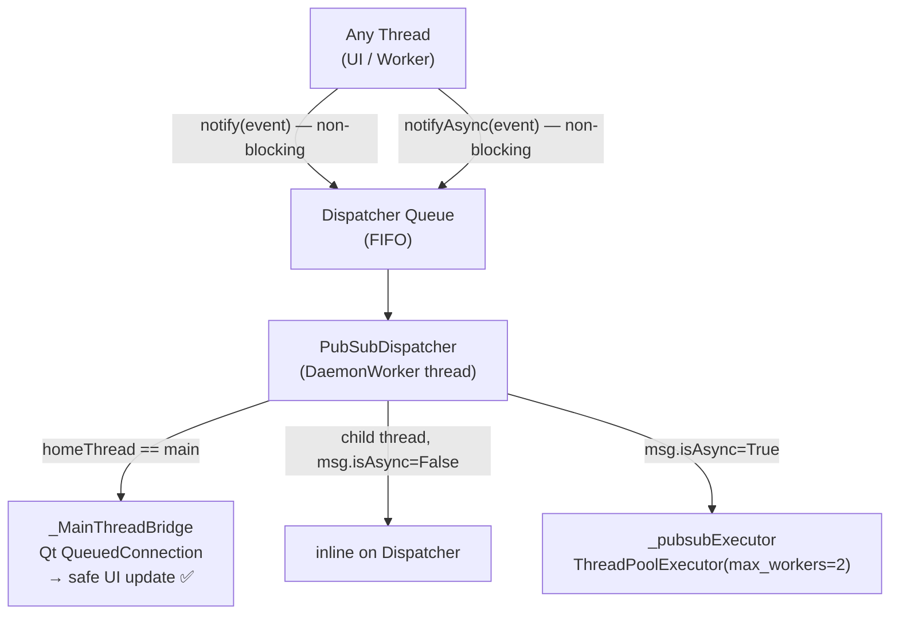

# Observer Pattern - Publisher/Subscriber Event System

> **Queue-based, thread-aware, non-blocking event dispatch**
> **Last synced**: `2026-05-26`

## Overview

The Observer pattern uses a Publisher/Subscriber model to:

- Decouple components (avoiding hard dependencies)
- Enable event-driven communication
- Provide **non-blocking** `notify()` / `notifyAsync()` via a background dispatcher thread
- Guarantee **UI thread safety** for main-thread subscribers via `_MainThreadBridge`
- Support **async I/O handlers** via a dedicated `ThreadPoolExecutor` (`notifyAsync()` — sender-side opt-in)
- Use smart parameter injection (type-hint aware matching)

## Architecture


```mermaid
flowchart TD
    A["Any Thread\n(UI / Worker)"] -->|"notify(event) — non-blocking"| Q["Dispatcher Queue\n(FIFO)"]
    A -->|"notifyAsync(event) — non-blocking"| Q
    Q --> D["PubSubDispatcher\n(DaemonWorker thread)"]
    D -->|homeThread == main| B["_MainThreadBridge\nQt QueuedConnection\n→ safe UI update ✅"]
    D -->|"child thread, msg.isAsync=False"| I["inline on Dispatcher"]
    D -->|"msg.isAsync=True"| T["_pubsubExecutor\nThreadPoolExecutor(max_workers=2)"]
```

### Key Components

| Class | Role |
|---|---|
| `Publisher` (singleton) | Manages subscribers, queues events, routes delivery |
| `_PubSubDispatcher` | `DaemonWorker` thread draining the event queue |
| `_MainThreadBridge` | `QObject` relaying events to Qt main thread via `QueuedConnection` |
| `UpdatableMixin` | Provides `update()` with smart parameter injection; base for `Subscriber` |
| `Subscriber` | Base observer extending `UpdatableMixin`; auto-subscribes at construction |

## API Reference

### Publisher

```python
from core import Publisher

pub = Publisher.instance()   # or Publisher.globalInstance()

pub.notify('event.name', arg1, key=value)       # non-blocking, sync delivery on Dispatcher ✅
pub.notifyAsync('event.name', arg1, key=value)  # non-blocking, async delivery via ThreadPoolExecutor ✅
pub.subscribe(sub, event='my.event')             # or event=None for global
pub.unsubscribe(sub, event='my.event')           # or event=None for all
pub.connect(widget, 'clicked', 'ui.click')      # Qt signal → event
pub.stop()                                       # graceful dispatcher shutdown + executor shutdown
```

### Subscriber

```python
from core import Subscriber

class MyHandler(Subscriber):
    def __init__(self):
        super().__init__(events=['user.login', 'user.logout'])

    def onUserLogin(self, userId: int, username: str):
        pass

    def onUserLogout(self, userId: int):
        pass
```

**Event handler naming**: `on` + `PascalCase(event_name)`
- `user.login` → `onUserLogin`
- `task.progress` → `onTaskProgress`

## Thread Routing

Subscribers capture `_homeThread` at construction time. Delivery mode is determined by the **sender**:

| Subscriber registered on | Sender uses | Delivery mechanism |
|---|---|---|
| Main thread | `notify()` or `notifyAsync()` | `_MainThreadBridge` → Qt `QueuedConnection` (UI-safe) |
| Child thread | `notify()` | Inline on Dispatcher thread |
| Child thread | `notifyAsync()` | `_pubsubExecutor` → `ThreadPoolExecutor(max_workers=2)` |

### Sender-side fire-and-forget

Async delivery is a **sender** decision, not a subscriber class attribute:

```python
# Blocks Dispatcher thread while handler runs
publisher.notify('task.started', taskId=uuid)

# Offloads delivery to a dedicated ThreadPoolExecutor — Dispatcher returns immediately
publisher.notifyAsync('api.sync', vendorId=42)
```

Use `notifyAsync()` when the handler performs I/O (API calls, DB writes, etc.).

## Smart Parameter Injection

`Subscriber.update()` dispatches to `onEventName()` using priority:

1. **By kwarg name**: `userId=123` → param `userId`
2. **By type hint**: `arg: int` → first unused `int` argument
3. **By position**: first unused arg → first unmatched param

```python
publisher.notify('complex.event', 123, 'john', {'key': 'value'})
publisher.notify('complex.event', userId=123, username='john')
```

## Shutdown

```python
# In QtAppContext._onExit():
publisher.notify('app.shutdown')
publisher.stop()   # gracefully drains and stops dispatcher thread + shuts down ThreadPoolExecutor
```

## Usage Examples

### Basic

```python
publisher = Publisher.instance()
publisher.notify('user.login', userId=123, username='john')
```

### Global Subscriber

```python
class GlobalHandler(Subscriber):
    def __init__(self):
        super().__init__(events=[], isGlobalSubscriber=True)

    def update(self, event: str, *args, **kwargs):
        print(f'Event: {event}')
```

### Qt Signal Integration

```python
publisher.connect(button, 'clicked', 'button.clicked', buttonId='submit')
```

### Task Progress

```python
class MyTask(AbstractTask):
    def handle(self):
        publisher = Publisher.instance()
        publisher.notify('task.progress', taskId=self.uuid, progress=50)
        publisher.notify('task.completed', taskId=self.uuid)
```

## Thread Safety

| Operation | Thread-safe? |
|---|---|
| `notify()` / `notifyAsync()` | ✅ — enqueue only, no lock needed |
| `subscribe()` / `unsubscribe()` | ✅ QMutex |
| Main-thread handler execution | ✅ via `_MainThreadBridge` + `QueuedConnection` |
| Child-thread handler (inline) | ✅ runs on Dispatcher thread, no Qt objects |
| Async handler execution | ✅ `ThreadPoolExecutor` — isolated from Qt objects |

## Best Practices

### ✅ DO

```python
# Namespaced event names
publisher.notify('user.login', userId=123)

# Type hints for smart injection
def onUserLogin(self, userId: int, username: str): pass

# Subscribe specific events only
class MyHandler(Subscriber):
    def __init__(self):
        super().__init__(events=['user.login'])

# For I/O-heavy events, use notifyAsync() at the call site
publisher.notifyAsync('api.sync', vendorId=42)  # offloads to ThreadPoolExecutor
```

### ❌ DON'T

```python
# Don't call handler methods directly
handler.onUserLogin(123, 'john')    # Wrong! Use publisher.notify()

# Don't create circular events
class A(Subscriber):
    def onEventA(self):
        publisher.notify('event.b')  # OK if B doesn't emit event.a

# Don't set pubsubFireAndForget = True on subscribers — that attribute no longer exists.
# Fire-and-forget is a sender concern: use publisher.notifyAsync() instead.
```

## TaskChain Subscription Lifecycle

`TaskChain` auto-subscribes to `'ChainProgressUpdateRequest'` at construction. Unsubscribe is guaranteed via `_done()` — called in `AbstractTask.run()` finally block on **all** exit paths (complete, fail, exception).

For the cancelled-before-run case (task still PENDING when `cancel()` is called), `_performCancellationCleanup()` handles unsubscribe since `run()` and `_done()` are never invoked.

> **Subclass rule**: If a `TaskChain` subclass overrides `_done()`, it **must** call `super()._done()` to preserve cleanup guarantees.

## Testing

```bash
pixi run ctests tests_core/observer/ -v
```

Tests verify:
- `notify()` returns before subscriber finishes (non-blocking)
- Main-thread subscribers receive events on main thread
- Child-thread subscribers receive events off main thread
- FIFO ordering guaranteed
- `unsubscribe()` stops delivery
- `notifyAsync()` offloads to ThreadPoolExecutor

## Related

- [BaseController](04-controller-architecture.md) — auto-unsubscribes handler on destroy
- [QtAppContext](01-application-context.md) — publisher access, shutdown
- [Task System](12-task-system-overview.md) — background task execution
