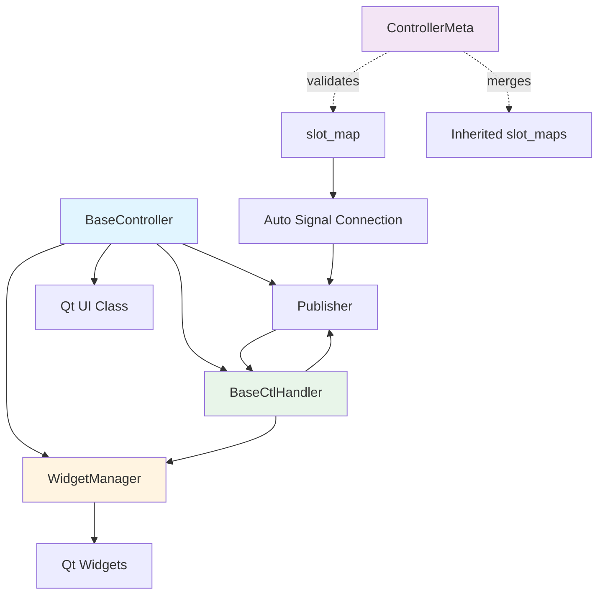

# BaseController - UI Controller Architecture

> **Base class for UI controllers with slot_map mechanism and auto handler discovery**

## Overview

`BaseController` is the abstract base class for all UI controllers. It provides:

- **`slot_map`**: Declarative UI event → Observer event mapping
- **Auto handler discovery**: Automatically discovers and initializes the designated Handler class
- **WidgetManager integration**: Dot-notation widget access
- **Publisher integration**: Event-driven architecture
- **Metaclass validation**: Enforces `slot_map` configuration requirements at runtime

## API Reference

### Class Definition

```python
from core import BaseController
from PySide6.QtWidgets import QWidget

class MyController(BaseController, QWidget):
    slot_map = {
        'eventName': ['widgetName', 'signalName']
    }
    
    def setupUi(self, widget):
        # UI setup (from .ui file or manual)
        pass
```

**Inheritance order:** UI class first, BaseController second, Widget (from Qt) last

```python
# ✅ Correct
class MyController(UI_Complied, BaseController, QWidget):
    pass
class MyController(UI_MainWindow, BaseController, QMainWindow):
    pass
# ❌ Wrong
class MyController(QWidget, BaseController):
    pass
```

### slot_map

**Format:**

```python
slot_map = {
    'eventName': ['widgetName', 'signalName'],
    'anotherEvent': ['anotherWidget', 'anotherSignal']
}
```

**Callable slot_map:**

```python
slot_map = {
    'customEvent': lambda handler, publisher: custom_logic(handler, publisher)
}
```

### Properties

```python
self.widgetManager  # WidgetManager instance
self.publisher      # Publisher instance
self.controllerName # Class name
self.handler        # Auto-discovered handler (if exists)
```

### Methods

```python
def setupUi(self, widget):
    """Abstract method - must implement"""
    pass

def setupHandler(self):
    """Auto-discover and initialize handler"""
    pass
```

## Usage Examples

### Basic Controller

```python
from core import BaseController
from PySide6.QtWidgets import QWidget, QPushButton, QLineEdit

class LoginController(BaseController, QWidget):
    slot_map = {
        'loginClicked': ['loginButton', 'clicked'],
        'cancelClicked': ['cancelButton', 'clicked']
    }
    
    def setupUi(self, widget):
        # Manual UI setup
        self.loginButton = QPushButton('Login')
        self.cancelButton = QPushButton('Cancel')
        self.usernameInput = QLineEdit()
        self.passwordInput = QLineEdit()
        
        # Layout setup...
```

### With Qt Designer .ui File

```python
from core import BaseController
from app.windows.login.Login import Ui_Login  # Generated from .ui

class LoginController(Ui_Login, BaseController):
    slot_map = {
        'loginClicked': ['loginButton', 'clicked'],
        'cancelClicked': ['cancelButton', 'clicked']
    }
    
    def setupUi(self, widget):
        # Ui_Login.setupUi called automatically by BaseController
        super().setupUi(widget)
```

### Handler Auto-Discovery

**Controller:**

```python
# File: app/windows/main/MainController.py
class MainController(BaseController, QWidget):
    slot_map = {
        'saveClicked': ['saveButton', 'clicked']
    }
```

**Handler (auto-discovered):**

```python
# File: app/windows/main/MainControllerHandler.py
from core import BaseCtlHandler

class MainControllerHandler(BaseCtlHandler):
    def onSaveClicked(self):
        data = self.widgetManager.get('dataInput').text()
        # Process data...
```

**Search paths:**
1. `app.windows.handlers.MainControllerHandler`
2. `app.windows.main.MainControllerHandler`

**Search class names:**
1. `MainControllerHandler`
2. `MainHandler` (without "Controller")
3. `MainWidgetHandler` (without "Widget")

### Accessing Widgets

```python
class MyController(BaseController, QWidget):
    def someMethod(self):
        # Via widgetManager
        button = self.widgetManager.get('saveButton')
        text = self.widgetManager.get('input.text')  # Nested access
        
        # Direct access (if defined in setupUi)
        button = self.saveButton
```

### Custom slot_map Logic

```python
class AdvancedController(BaseController, QWidget):
    slot_map = {
        'normalEvent': ['button', 'clicked'],
        'customEvent': lambda handler, publisher: (
            publisher.connect(handler.widgetManager.get('customWidget'),
                            'customSignal',
                            'customEvent',
                            extraData='value')
        )
    }
```

## Handler Pattern

### BaseCtlHandler

```python
from core import BaseCtlHandler

class MyControllerHandler(BaseCtlHandler):
    def __init__(self, widgetManager, events):
        super().__init__(widgetManager, events)
        # self.widgetManager available
        # self.controller available
    
    def onEventName(self, arg1, arg2):
        # Event handler
        # Access widgets via self.widgetManager
        # Access controller via self.controller
        pass
```

### Example Handler

```python
from core import BaseCtlHandler

class LoginControllerHandler(BaseCtlHandler):
    def onLoginClicked(self):
        username = self.widgetManager.get('usernameInput').text()
        password = self.widgetManager.get('passwordInput').text()
        
        if self._validateCredentials(username, password):
            # Publish event for other components
            from core import Publisher
            Publisher.instance().notify('user.login', username=username)
        else:
            self.widgetManager.get('errorLabel').setText('Invalid credentials')
    
    def onCancelClicked(self):
        self.controller.close()
    
    def _validateCredentials(self, username, password):
        # Validation logic
        return len(username) > 0 and len(password) > 0
```

## Architecture



## ControllerMeta Metaclass

### Validation

```python
class MyController(BaseController, QWidget):
    # Missing slot_map → TypeError
    pass

# TypeError: Class 'MyController' must define the following attributes: slot_map
```

### slot_map Inheritance

```python
class BaseController(BaseController, QWidget):
    slot_map = {
        'baseEvent': ['baseButton', 'clicked']
    }

class ChildController(BaseController):
    slot_map = {
        'childEvent': ['childButton', 'clicked']
    }

# ChildController.slot_map contains both baseEvent and childEvent
```

## Best Practices

### ✅ DO

```python
# Use descriptive event names
slot_map = {
    'saveDataClicked': ['saveButton', 'clicked'],
    'cancelOperationClicked': ['cancelButton', 'clicked']
}

# Keep controllers thin - delegate to handlers
class MyController(BaseController, QWidget):
    slot_map = {'saveClicked': ['saveButton', 'clicked']}
    
    def setupUi(self, widget):
        # Only UI setup
        pass

# Use WidgetManager for widget access
text = self.widgetManager.get('input').text()

# Separate handler file
# app/windows/main/MainController.py
# app/windows/main/MainControllerHandler.py

# Use type hints in handlers
def onSaveClicked(self, data: dict):
    pass
```

### ❌ DON'T

```python
# Don't put business logic in controller
class MyController(BaseController, QWidget):
    def setupUi(self, widget):
        # Wrong! Business logic in controller
        self.database = Database()
        self.api = ApiClient()

# Don't call setupUi manually
class MyController(BaseController, QWidget):
    def __init__(self):
        super().__init__()
        self.setupUi(self)  # Wrong! BaseController calls this

# Don't forget slot_map
class MyController(BaseController, QWidget):
    # Missing slot_map → Error
    pass

# Don't use wrong inheritance order
class MyController(BaseController, QWidget):  # Wrong order
    pass

# Don't access widgets before setupUi
class MyController(BaseController, QWidget):
    def __init__(self):
        super().__init__()
        text = self.input.text()  # Wrong! setupUi not called yet
```

## Common Patterns

### Form Controller

```python
class UserFormController(BaseController, QWidget):
    slot_map = {
        'saveClicked': ['saveButton', 'clicked'],
        'cancelClicked': ['cancelButton', 'clicked'],
        'resetClicked': ['resetButton', 'clicked']
    }

class UserFormHandler(BaseCtlHandler):
    def onSaveClicked(self):
        userData = {
            'name': self.widgetManager.get('nameInput').text(),
            'email': self.widgetManager.get('emailInput').text()
        }
        # Save data...
    
    def onCancelClicked(self):
        self.controller.close()
    
    def onResetClicked(self):
        self.widgetManager.get('nameInput').clear()
        self.widgetManager.get('emailInput').clear()
```

### Dialog Controller

```python
from PySide6.QtWidgets import QDialog

class ConfirmDialogController(BaseController, QDialog):
    slot_map = {
        'acceptClicked': ['okButton', 'clicked'],
        'rejectClicked': ['cancelButton', 'clicked']
    }

class ConfirmDialogHandler(BaseCtlHandler):
    def onAcceptClicked(self):
        self.controller.accept()
    
    def onRejectClicked(self):
        self.controller.reject()
```

### Component Controller

```python
# Reusable component
class SearchBoxController(BaseController, QWidget):
    slot_map = {
        'searchTriggered': ['searchButton', 'clicked'],
        'textChanged': ['searchInput', 'textChanged']
    }

class SearchBoxHandler(BaseCtlHandler):
    def onSearchTriggered(self):
        query = self.widgetManager.get('searchInput').text()
        Publisher.instance().notify('search.triggered', query=query)
    
    def onTextChanged(self, text: str):
        # Live search
        if len(text) >= 3:
            Publisher.instance().notify('search.live', query=text)
```

## Related Documentation

- [WidgetManager](05-widget-management.md) - Widget access
- [Observer Pattern](03-observer-pattern.md) - Event system
- [Common Use Cases](20-common-use-cases.md) - Practical examples

## Troubleshooting

**Q: Handler not found**

```python
# Check file structure:
# app/windows/main/MainController.py
# app/windows/main/MainControllerHandler.py

# Or:
# app/windows/handlers/MainControllerHandler.py

# Check class name matches
class MainControllerHandler(BaseCtlHandler):  # Must match pattern
    pass
```

**Q: slot_map not working**

```python
# Check widget name exists
slot_map = {
    'saveClicked': ['saveButton', 'clicked']  # saveButton must exist
}

# Check signal name correct
slot_map = {
    'saveClicked': ['saveButton', 'clicked']  # 'clicked' not 'click'
}
```

**Q: TypeError about slot_map**

```python
# Must define slot_map
class MyController(BaseController, QWidget):
    slot_map = {}  # Even if empty
```
