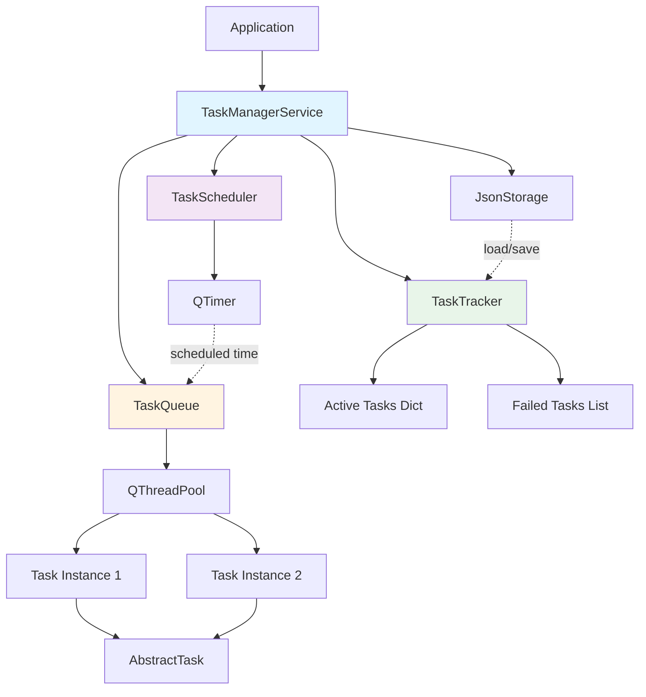
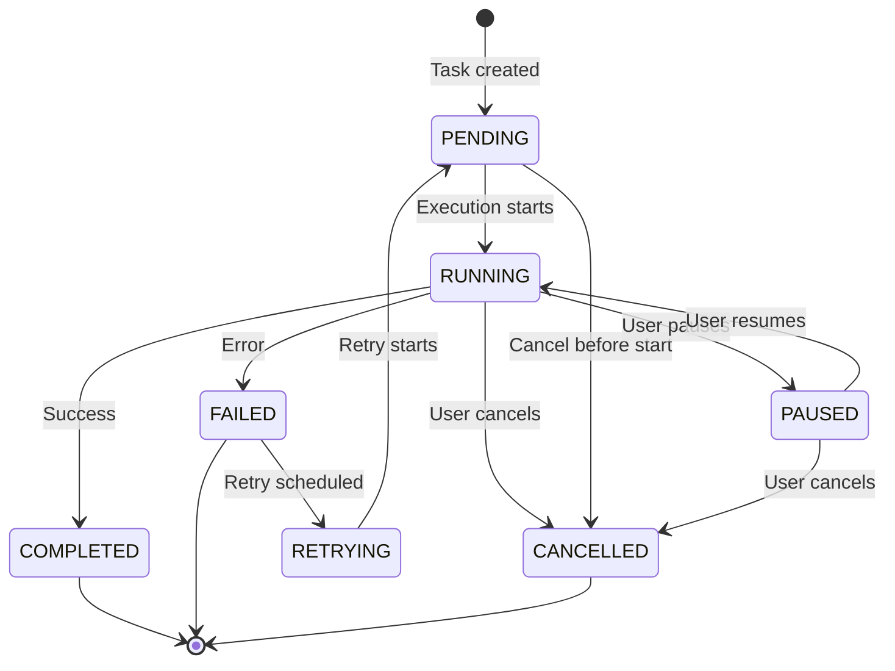

# Task System Overview

> **Background task execution with scheduling, chaining, and persistence**
> **Last synced**: `2026-06-09`

## Architecture


```mermaid
graph TB
    App[Application] --> TaskManager[TaskManagerService]
    
    TaskManager --> TaskQueue
    TaskManager --> TaskTracker
    TaskManager --> TaskScheduler
    TaskManager --> Storage[JsonStorage]
    
    TaskQueue --> ThreadPool[QThreadPool]
    ThreadPool --> Task1[Task Instance 1]
    ThreadPool --> Task2[Task Instance 2]
    
    TaskTracker --> ActiveTasks[Active Tasks Dict]
    TaskTracker --> FailedTasks[Failed Tasks List]
    
    TaskScheduler --> QTimer[QTimer]
    QTimer -.->|scheduled time| TaskQueue
    
    Storage -.->|load/save| TaskTracker
    
    Task1 --> AbstractTask
    Task2 --> AbstractTask
    
    style TaskManager fill:#e1f5ff
    style TaskQueue fill:#fff4e1
    style TaskTracker fill:#e8f5e9
    style TaskScheduler fill:#f3e5f5
```

## Components

### TaskManagerService

Central orchestrator:

- Unified API for task management
- Coordinates subsystems
- Aggregates signals/events

### TaskQueue

Execution engine:

- QThreadPool-based
- FIFO concurrent task execution
- Max concurrent tasks limit
- DaemonWorker for serialized queue mutations (no race conditions)

### TaskTracker

State management:

- Active tasks tracking
- Task status monitoring
- **Reverse Indexing**: Efficient tag-based lookup
- Runtime statistics (execution time, retry attempts)
- Signals: taskAdded, taskRemoved, taskStatusUpdated, taskFinished, failedTaskLogged

> **Note**: `_isTaskChain()` uses MRO name traversal — `TaskChain` subclasses (e.g. `AmzCheckerChain`) are correctly recognized as chains and receive full chain lifecycle handling.

### TaskScheduler

Scheduling engine:

- Pure Qt implementation — uses `QTimer`, no background threads
- Date-based scheduling (one-time)
- Interval scheduling (recurring)
- Daily cron-style scheduling (hour:minute)
- Persistence via JsonStorage

### Storage

Persistence layer:

- JSON-based storage
- Task serialization/deserialization
- State recovery

## Task Lifecycle


```mermaid
stateDiagram-v2
    [*] --> PENDING: Task created
    PENDING --> RUNNING: Execution starts
    RUNNING --> COMPLETED: Success
    RUNNING --> FAILED: Error
    RUNNING --> CANCELLED: User cancels
    PENDING --> CANCELLED: Cancel before start
    PAUSED --> CANCELLED: User cancels
    RUNNING --> PAUSED: User pauses
    PAUSED --> RUNNING: User resumes
    FAILED --> RETRYING: Retry scheduled
    RETRYING --> PENDING: Retry starts
    COMPLETED --> [*]
    FAILED --> [*]
    CANCELLED --> [*]
```

## Key Features

### Concurrent Execution

```python
# Set max concurrent tasks
taskManager.setMaxConcurrentTasks(5)

# Add multiple tasks
for i in range(10):
    taskManager.addTask(MyTask(name=f'Task {i}'))
```

### Scheduling

```python
from datetime import datetime, timedelta

# Date-based (one-time)
taskManager.addTask(task, scheduleInfo={
    'trigger': 'date',
    'runDate': datetime.now() + timedelta(hours=1)
})

# Interval
taskManager.addTask(task, scheduleInfo={
    'trigger': 'interval',
    'intervalSeconds': 60
})

# Daily cron
taskManager.addTask(task, scheduleInfo={
    'trigger': 'cron',
    'hour': 9,
    'minute': 0
})
```

### Task Chaining

```python
chain = taskManager.addChainTask(
    name='Data Pipeline',
    tasks=[FetchTask(), ProcessTask(), SaveTask()],
    retryBehaviorMap={
        'FetchTask': ChainRetryBehavior.RETRY_TASK,
        'ProcessTask': ChainRetryBehavior.SKIP_TASK
    }
)
```

### Task State & Thread Synchronization (`TaskState`)

Task interruption (pause, resume, cancellation) is centrally managed by the thread-safe `TaskState` wrapper located in `core/taskSystem/TaskState.py`.

- Injects safely into independent services allowing them to cooperatively check the task's status via `isStopped()` or `isPaused()` without requiring a hard dependency on the full `AbstractTask`.
- Encapsulates `TaskStatus` and uses `QMutex` and `QWaitCondition` to seamlessly block (suspend) runner threads.

```python
# In an external service that takes taskState as a dependency:
def executeLongOperation(self):
    for item in large_list:
        # Raises TaskCancellationException if cancelled
        self.taskState.throwIfCancelled() 
        
        # Blocks thread execution inherently if the task is paused
        self.taskState.waitIfPaused()
        
        process(item)
```

### Bulk Actions

```python
# Stop all network tasks
taskManager.stopTasksByTag('Network')

# Pause all tasks by tag
taskManager.pauseTasksByTag('HeavyComputation')
```

### Persistence

```python
# Auto-save on task completion
# Auto-load on startup
taskManager.loadState()
taskManager.saveState()
```

## Threading Model

- **Main Thread**: TaskManagerService, TaskTracker, TaskScheduler
- **Worker Threads**: Task execution (QThreadPool)
- **Queue Worker Thread**: DaemonWorker serializes all queue mutations
- **Thread-safe**: TaskTracker uses `threading.RLock`; TaskState uses `QMutex`

## Signals

### TaskManagerService

```python
taskManager.taskAdded.connect(onTaskAdded)                   # (uuid: str)
taskManager.taskRemoved.connect(onTaskRemoved)               # (uuid: str)
taskManager.taskFinished.connect(onFinished)                 # (uuid: str, task: AbstractTask, result: Any, err: Optional[dict])
taskManager.taskStatusUpdated.connect(onStatusChanged)       # (uuid: str, status: TaskStatus)
taskManager.taskProgressUpdated.connect(onProgress)          # (uuid: str, progress: int, label: str)
taskManager.failedTaskLogged.connect(onFailedTaskLogged)     # (taskInfo: dict)
taskManager.systemReady.connect(onSystemReady)               # ()
```

### AbstractTask

```python
task.statusChanged.connect(onStatusChanged)    # (uuid: str, status: TaskStatus)
task.progressUpdated.connect(onProgress)       # (uuid: str, progress: int, label: str)
task.taskFinished.connect(onFinished)          # (uuid: str, task: AbstractTask, result: Any, err: Optional[dict])
```

## Usage Pattern

```python
from core import QtAppContext
from core.taskSystem import AbstractTask

# 1. Access TaskManager
ctx = QtAppContext.globalInstance()
taskManager = ctx.taskManager

# 2. Create task
class MyTask(AbstractTask):
    def handle(self):
        for i in range(100):
            if self.isStopped():
                return
            # Do work...
            self.setProgress(i)
    
    def _performCancellationCleanup(self):
        pass
    
    @classmethod
    def deserialize(cls, data: dict):
        return cls(name=data['name'])

# 3. Add to queue
task = MyTask(name='My Task')
taskManager.addTask(task)

# 4. Monitor status
taskManager.taskStatusUpdated.connect(lambda uuid, status: print(f'{uuid}: {status}'))
```

## Best Practices

### ✅ DO

```python
# Check isStopped() regularly
def handle(self):
    for item in items:
        if self.isStopped():
            return
        # Process item...

# Update progress
def handle(self):
    total = len(items)
    for i, item in enumerate(items):
        # Process...
        self.setProgress(int(i / total * 100))

# Use scoped services
def handle(self):
    ctx = QtAppContext.globalInstance()
    taskId = self.uuid
    
    browser = ChromeBrowserService()
    ctx.registerScopedService(taskId, browser)
    
    try:
        # Use browser...
        pass
    finally:
        ctx.releaseScope(taskId)
```

### ❌ DON'T

```python
# Don't block indefinitely
def handle(self):
    while True:  # Wrong! No stop check
        # Work...
        pass

# Don't use NetworkManager
def handle(self):
    ctx = QtAppContext.globalInstance()
    network = ctx.network  # Wrong! Use requests

# Don't forget cleanup
def handle(self):
    browser = ChromeBrowserService()
    # Use browser...
    # Missing: cleanup!
```

## Related Documentation

- [AbstractTask](13-abstract-task.md) - Base task class
- [TaskChain](14-task-chain.md) - Sequential execution (Chaining)
- [TaskManager](15-task-manager.md) - API reference
