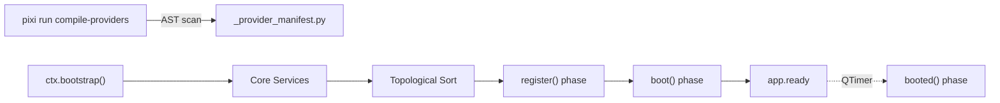

# ServiceProvider — App Service Bootstrap Architecture

> **Declarative service registration with systemd-inspired ordering and build-time discovery**

## Overview

`ServiceProvider` is the recommended way to register app-level services during bootstrap.
Instead of scattering `ctx.registerService(...)` calls throughout `main.py`, you declare each
service as a **provider class** in `app/providers/`.

Key features:

- **Build-time discovery**: `scripts/compile_providers.py` generates a manifest — zero overhead at runtime
- **Lifecycle phases**: `register()` → `boot()` → `booted()` — clean dependency resolution and non-blocking initialization
- **systemd-inspired ordering**: `after`, `requires`, `wants` for dependency management
- **Error resilience**: Failed providers logged + shown via `WidgetUtils.showAlertMsgBox()`



---

## Quick Start

### 1. Generate a Provider

```bash
python scripts/generate.py provider MyService -d "Register MyService singleton"
# Creates: app/providers/MyServiceProvider.py
```

### 2. Implement register()

```python
# app/providers/MyServiceProvider.py
from core.contracts.ServiceProvider import ServiceProvider

class MyServiceProvider(ServiceProvider):
    """Register MyService singleton."""

    def register(self):
        from app.services.MyService import MyService
        self.ctx.registerService('myService', MyService())
```

### 3. Compile & Run

```bash
pixi run compile-providers  # Generate manifest
pixi run start              # Or: pixi run dev (auto-compiles)
```

### 4. Access the Service

```python
from core.QtAppContext import QtAppContext

ctx = QtAppContext.globalInstance()
myService = ctx.getService('myService')
```

---

## API Reference

### ServiceProvider Base Class

```python
from core.contracts.ServiceProvider import ServiceProvider

class MyProvider(ServiceProvider):
    # --- Class Attributes (all optional) ---
    discoverable: bool = True     # Include in manifest?
    after: List[str] = []         # Run after these providers
    requires: List[str] = []      # Hard dependency — skip if failed
    wants: List[str] = []         # Soft dependency — tolerate failure

    def register(self):
        """Register services. Called on main thread."""
        self.ctx.registerService('name', instance)

    def boot(self):
        """Optional. Called after ALL providers registered."""
        pass

    def booted(self):
        """Optional. Called asynchronously after app is fully bootstrapped."""
        pass
```

#### Available in all methods

| Property | Type | Description |
| --- | --- | --- |
| `self.ctx` | `QtAppContext` | Application context singleton |

---

## Ordering — systemd-style

### `after`

Provider runs **after** the listed providers. Pure ordering, no failure propagation.

```python
class DataServiceProvider(ServiceProvider):
    after = ['ProxyManagerProvider']  # ProxyManager registers first
```

### `requires`

Hard dependency. If a required provider **fails**, this provider is **skipped**.

```python
class RaffleWatcherProvider(ServiceProvider):
    requires = ['ProxyManagerProvider', 'DataServiceProvider']
```

### `wants`

Soft dependency. Order is respected, but failure is **tolerated**.

```python
class AnalyticsProvider(ServiceProvider):
    wants = ['DataServiceProvider']  # Nice to have, not critical
```

### Evaluation Order

Dependencies are resolved via **Kahn's algorithm** (topological sort).
Circular dependencies are detected and logged as errors.

---

## Build-Time Discovery

### How It Works

```bash
pixi run compile-providers
```

1. Scans `app/providers/*Provider.py`
2. AST-parses each file (no imports needed)
3. Finds classes subclassing `ServiceProvider`
4. Checks `discoverable` attribute (default `True`)
5. Writes `app/providers/_provider_manifest.py`

### Excluding a Provider

```python
class AbstractBaseProvider(ServiceProvider):
    discoverable = False  # Not included in manifest

    def register(self):
        pass
```

### Generated Manifest

```python
# app/providers/_provider_manifest.py (auto-generated)
PROVIDERS = [
    'app.providers.DataServiceProvider.DataServiceProvider',
    'app.providers.ProxyManagerProvider.ProxyManagerProvider',
]
```

---

## Error Handling

| Phase | Behavior |
| --- | --- |
| **Import** | Error logged + `WidgetUtils.showAlertMsgBox()` |
| **register()** | Error logged + alert + provider marked as failed |
| **boot()** | Error logged + alert |
| **booted()** | Error propagated to global exception handler |
| **requires** dep failed | Provider skipped with warning |

---

## CLI Scaffolding

```bash
# Generate a new provider
python scripts/generate.py provider MyFeature -d "Register MyFeature service"

# Equivalent shorthand
pixi run gen provider MyFeature -d "Registers MyFeature"
```

Output: `app/providers/MyFeatureProvider.py`

> **Reminder**: Run `pixi run compile-providers` after creating or removing providers.

---

## Best Practices

### ✅ DO

```python
# Use lazy imports inside register()
class MyProvider(ServiceProvider):
    def register(self):
        from app.services.heavy import HeavyService  # Lazy
        self.ctx.registerService('heavy', HeavyService())

# Declare dependencies explicitly
class DependentProvider(ServiceProvider):
    requires = ['ProxyManagerProvider']

# Use boot() for cross-service wiring
class WiringProvider(ServiceProvider):
    after = ['ServiceA', 'ServiceB']
    def boot(self):
        a = self.ctx.getService('serviceA')
        b = self.ctx.getService('serviceB')
        a.connectTo(b)

# Use booted() for heavy background initialization
class BackgroundProvider(ServiceProvider):
    def booted(self):
        # ✅ Avoid blocking the UI thread during startup
        self.ctx.getService('heavyService').initialize()
```

### ❌ DON'T

```python
# Don't import heavy modules at module level
from app.services.heavy import HeavyService  # ❌ Slows down manifest loading

# Don't register services in boot()
class BadProvider(ServiceProvider):
    def boot(self):
        self.ctx.registerService('late', Something())  # ❌ Use register()

# Don't forget to compile after changes
# pixi run compile-providers  ← always run after adding/removing providers
```

---

## Related Documentation

- [QtAppContext](01-application-context.md) — Application lifecycle
- [ServiceLocator](02-dependency-injection.md) — DI container details
- [CLI Scripts](23-cli-scripts.md) — All available scripts
