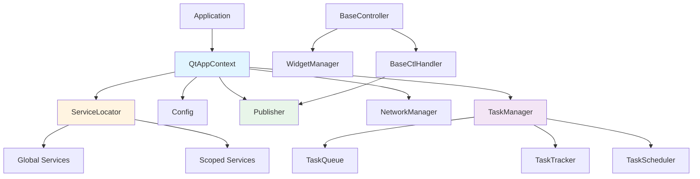

# ☄️ UltraBug [z] PysideBase ☄️ Documentation

> **Comprehensive reference for the `core` namespace**  
> Last updated: 2026-01-21

## Overview

The `core` namespace is the foundation of the framework, providing essential building blocks for the PySide6 application:

- **Application Lifecycle**: QtAppContext manages startup, feature flags, and shutdown
- **Dependency Injection**: ServiceLocator with global and scoped services
- **Event System**: Observer pattern (Publisher/Subscriber) for decoupled communication
- **UI Architecture**: BaseController + WidgetManager + Handler pattern
- **Task System**: Background task execution with scheduling, chaining, and persistence
- **Utilities**: Logging, Config, Exception handling, and Path management

## Quick Start

### Minimal Application

```python
from core import QtAppContext

# 1. Get global instance
ctx = QtAppContext.globalInstance()

# 2. Bootstrap application
ctx.bootstrap()

# 3. Access core services
config = ctx.config
publisher = ctx.publisher
logger = ctx.logger

# 4. Run Qt event loop
ctx.run()
```

### Creating a Controller

```python
from core import BaseController, BaseCtlHandler
from PySide6.QtWidgets import QWidget

class MyController(BaseController, QWidget):
    slot_map = {
        'buttonClicked': ['myButton', 'clicked']
    }
    
    def setupUi(self, widget):
        # UI setup here
        pass

class MyControllerHandler(BaseCtlHandler):
    def onButtonClicked(self):
        self.widgetManager.get('myButton').setText('Clicked!')
```

## Architecture Overview



## Documentation Structure

### Core Components

| Component | Description |
|-----------|-------------|
| [**Application Context**](01-application-context.md) | QtAppContext lifecycle management |
| [**Dependency Injection**](02-dependency-injection.md) | ServiceLocator patterns |
| [**Observer Pattern**](03-observer-pattern.md) | Publisher/Subscriber event system |
| [**Controller Architecture**](04-controller-architecture.md) | BaseController and slot_map |
| [**Widget Management**](05-widget-management.md) | WidgetManager utilities |
| [**Configuration**](06-configuration.md) | Config singleton |
| [**Logging**](07-logging.md) | Loguru-based logging |
| [**Network Manager**](08-network-manager.md) | Qt network integration |
| [**Exceptions**](09-exceptions.md) | Exception handling |
| [**Utilities**](10-utilities.md) | PathHelper, OsHelper, PythonHelper, WidgetUtils |
| [**Decorators**](11-decorators.md) | @singleton, @catchExceptInMsgBox, etc. |

### Task System

| Component | Description |
|-----------|-------------|
| [**Task System Overview**](12-task-system-overview.md) | Architecture and components |
| [**AbstractTask**](13-abstract-task.md) | Base task class |
| [**Task Chain**](14-task-chain.md) | Sequential task execution |
| [**Task Manager**](15-task-manager.md) | TaskManagerService API |

### Advanced Features

| Component | Description |
|-----------|-------------|
| [**Acknowledgment System**](16-acknowledgment-system.md) | ACK/NACK protocol |
| [**Contracts**](17-contracts.md) | Interfaces |
| [**Extends**](18-extends.md) | Extensions |
| [**Model**](19-model.md) | Data models |

### Practical Guides

| Component | Description |
|-----------|-------------|
| [**Common Use Cases**](20-common-use-cases.md) | Recipes và examples |
| [**Pixi Guide**](22-pixi-guide.md) | Hướng dẫn sử dụng Pixi vs Pip |
| [**CLI Scripts**](23-cli-scripts.md) | Hướng dẫn sử dụng scripts tiện ích |
| [**Testing**](24-testing.md) | Hướng dẫn chạy test và viết test |

## Key Concepts

### Feature Flags

Core uses environment variables to enable/disable features:

```bash
# .env file
PSA_ENABLE_NETWORK=true   # Enable NetworkManager
PSA_ENABLE_TASKS=true     # Enable TaskSystem
```

### Service Lifecycle

**Global Services** (Singletons):
- Config, Publisher, NetworkManager, TaskManager
- Exist throughout the application lifetime

**Scoped Services** (Task-specific):
- Browser instances, temporary resources
- Automatically clean up when the task is completed

```python
ctx = QtAppContext.globalInstance()

# Global service
config = ctx.config

# Scoped service
taskId = self.uuid
browser = ChromeBrowserService()
ctx.registerScopedService(taskId, browser)
try:
    # Use browser
    pass
finally:
    ctx.releaseScope(taskId)  # Auto cleanup
```

### Event-Driven Architecture

```python
# Publisher
publisher = ctx.publisher
publisher.notify('user.login', userId=123)

# Subscriber
class MyHandler(Subscriber):
    def __init__(self):
        super().__init__(events=['user.login'])
    
    def onUserLogin(self, userId: int):
        print(f'User {userId} logged in')
```

## Design Principles

1. **Separation of Concerns**: Controller only wires UI, Handler processes logic
2. **Dependency Injection**: Use ServiceLocator instead of direct instantiation
3. **Event-Driven**: Components communicate via Publisher, avoiding direct coupling
4. **Thread-Safe**: QMutex for critical sections
5. **Resource Management**: Scoped services with auto cleanup

## Common Patterns

### Controller + Handler Pattern

```python
# Controller: UI wiring only
class MyController(BaseController, QWidget):
    slot_map = {
        'saveClicked': ['saveButton', 'clicked']
    }

# Handler: Business logic
class MyControllerHandler(BaseCtlHandler):
    def onSaveClicked(self):
        data = self.widgetManager.get('dataInput').text()
        # Process data...
```

### Background Task Pattern

```python
from core.taskSystem import AbstractTask

class MyTask(AbstractTask):
    def handle(self):
        for i in range(100):
            if self.isStopped():
                return
            # Do work...
            self.setProgress(i)

# Add to queue
ctx.taskManager.addTask(MyTask(name='My Task'))
```

### Scoped Resource Pattern

```python
def executeTask(self):
    ctx = QtAppContext.globalInstance()
    taskId = self.uuid
    
    # Register scoped resources
    browser = ChromeBrowserService()
    ctx.registerScopedService(taskId, browser)
    
    try:
        # Use resources
        browser.navigate('https://example.com')
    finally:
        # Auto cleanup all scoped services
        ctx.releaseScope(taskId)
```

## Migration from Old Docs

If you are using the old docs (`docs/provided-by-base/`), please note:

- ✅ **Architecture mindset is still valid**: Separation of concerns, Observer pattern
- ⚠️ **API details have changed**: Refer to the new docs for accuracy
- ⚠️ **New Feature flags**: PSA_ENABLE_* environment variables
- ⚠️ **ServiceLocator API**: `registerScopedService` instead of the old way

## Getting Help

- **API Reference**: See specific documentation files
- **Examples**: Refer to `20-common-use-cases.md`
- **Source Code**: `core/` directory with detailed docstrings
- **Issues**: Report via improvement suggestions

## Next Steps

- Read [Application Context](01-application-context.md) to understand the bootstrap process
- Read [Controller Architecture](04-controller-architecture.md) to create UI components
- Read [Task System Overview](12-task-system-overview.md) to handle background tasks
- Read [Common Use Cases](20-common-use-cases.md) for practical examples
