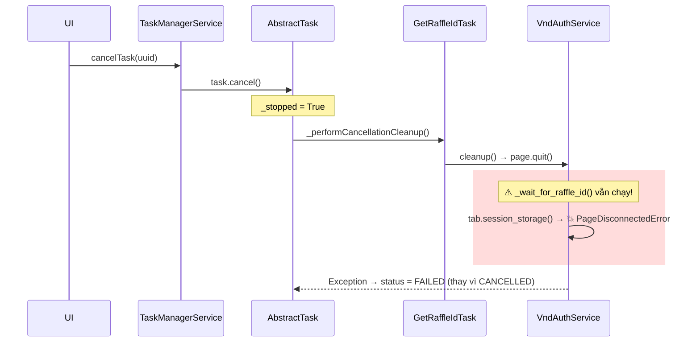
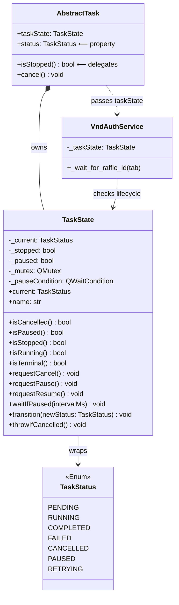
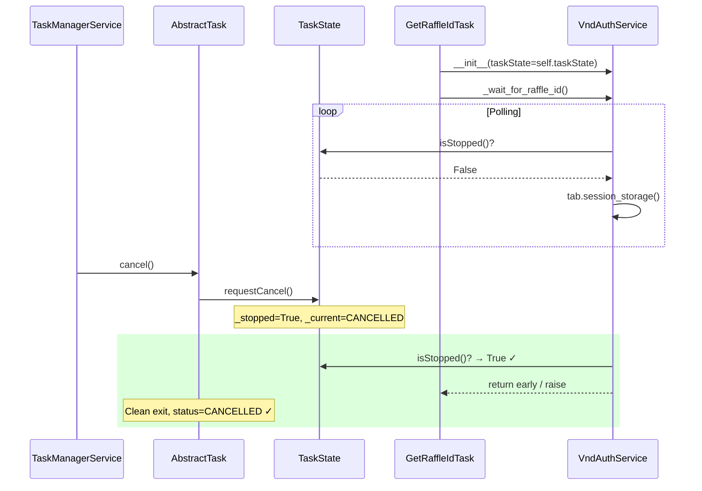

# Cancellation-Aware Services via `TaskState`

### Current Flow (Broken)



### Design: `TaskState` Wrapper

**Ý tưởng**: Giữ [TaskStatus](file://core/taskSystem/TaskStatus.py#28-49) (Enum) nguyên vẹn. Tạo `TaskState` class bọc enum + quản lý lifecycle flags. Inject vào services.



### Backward Compatibility

> [!IMPORTANT]
> [TaskStatus](file://core/taskSystem/TaskStatus.py#28-49) enum **không thay đổi**. Mọi code hiện tại dùng `TaskStatus.XXX` vẫn hoạt động.

| Existing Pattern | After Refactor | Breaking? |
|---|---|---|
| `task.status == TaskStatus.RUNNING` | `task.status == TaskStatus.RUNNING` → property returns `TaskState.current` | ❌ No |
| `task.status.name` | Property returns [TaskStatus](file://core/taskSystem/TaskStatus.py#28-49) enum → `.name` vẫn work | ❌ No |
| `task.setStatus(TaskStatus.X)` | Delegates to `taskState.transition(X)` | ❌ No |
| `isinstance(status, TaskStatus)` | Property returns [TaskStatus](file://core/taskSystem/TaskStatus.py#28-49) enum | ❌ No |
| `task.isStopped()` | Delegates to `taskState.isStopped()` | ❌ No |
| `task._stopped = True/False` (2 chỗ trong `TaskQueue._retryTask`) | ⚠️ Cần update sang `taskState.reset()` | ✅ Minor |

### Proposed Flow (Fixed)



### Implementation Details

#### [NEW] [TaskState.py](file://core/taskSystem/TaskState.py)

```python
class TaskState:
    """Thread-safe task lifecycle state. Injectable into services."""

    _TERMINAL = frozenset({TaskStatus.COMPLETED, TaskStatus.FAILED, TaskStatus.CANCELLED})
    _STOPPABLE = frozenset({TaskStatus.CANCELLED})

    def __init__(self, initial: TaskStatus = TaskStatus.PENDING):
        self._current = initial
        self._stopped = False
        self._paused = False
        self._mutex = QMutex()
        self._pauseCondition = QWaitCondition()

    @property
    def current(self) -> TaskStatus:
        """Current enum value (backward compat: task.status == TaskStatus.X)."""
        self._mutex.lock()
        val = self._current
        self._mutex.unlock()
        return val

    @property
    def name(self) -> str:
        return self.current.name

    def isCancelled(self) -> bool:
        self._mutex.lock()
        val = self._current == TaskStatus.CANCELLED or self._stopped
        self._mutex.unlock()
        return val

    def isPaused(self) -> bool:
        self._mutex.lock()
        val = self._paused
        self._mutex.unlock()
        return val

    def isStopped(self) -> bool:
        """True if cancel was requested (even if status hasn't transitioned yet)."""
        self._mutex.lock()
        val = self._stopped
        self._mutex.unlock()
        return val

    def isRunning(self) -> bool:
        return self.current == TaskStatus.RUNNING

    def isTerminal(self) -> bool:
        return self.current in self._TERMINAL

    def requestCancel(self) -> None:
        self._mutex.lock()
        self._stopped = True
        self._paused = False
        self._pauseCondition.wakeAll()
        self._mutex.unlock()

    def requestPause(self) -> None:
        self._mutex.lock()
        self._paused = True
        self._mutex.unlock()

    def requestResume(self) -> None:
        self._mutex.lock()
        self._paused = False
        self._pauseCondition.wakeAll()
        self._mutex.unlock()

    def waitIfPaused(self, intervalMs: int = 500) -> None:
        """Block calling thread while paused. Wakes on resume or cancel."""
        self._mutex.lock()
        while self._paused and not self._stopped:
            self._pauseCondition.wait(self._mutex, intervalMs)
        self._mutex.unlock()

    def transition(self, newStatus: TaskStatus) -> TaskStatus:
        """Thread-safe status transition. Returns old status."""
        self._mutex.lock()
        old = self._current
        self._current = newStatus
        self._mutex.unlock()
        return old

    def reset(self) -> None:
        """Reset for retry: clear stopped/paused flags."""
        self._mutex.lock()
        self._stopped = False
        self._paused = False
        self._mutex.unlock()

    def throwIfCancelled(self) -> None:
        if self.isStopped():
            raise TaskCancelledException('Operation cancelled')
```

#### [MODIFY] [AbstractTask.py](file://core/taskSystem/AbstractTask.py)

- Thêm `self.taskState = TaskState()` trong [__init__](file://core/taskSystem/AbstractTask.py#87-159)
- `self.status` → property delegating to `self.taskState.current`
- [setStatus()](file://core/taskSystem/AbstractTask.py#170-180) → calls `self.taskState.transition()`
- [isStopped()](file://core/taskSystem/AbstractTask.py#245-255) → `self.taskState.isStopped()`
- [cancel()](file://core/taskSystem/AbstractTask.py#256-277) → `self.taskState.requestCancel()`
- [pause()/resume()/checkPaused()](file://core/taskSystem/AbstractTask.py#203-213) → delegate to `taskState`
- Xóa `_stopMutex`, `_stopped`, `_pauseMutex`, `_pauseCondition`, `_isPaused` (chuyển vào `TaskState`)

#### [MODIFY] [TaskQueue.py](file://core/taskSystem/TaskQueue.py)

- Line 246-248: `task._stopped = False` → `task.taskState.reset()`

#### [MODIFY] [VndAuthService.py](file://app/services/auth/VndAuthService.py)

- Constructor nhận `taskState: Optional[TaskState] = None`
- [_wait_for_raffle_id](file://app/services/auth/VndAuthService.py#333-382): check `self._taskState.isStopped()` mỗi iteration

#### [MODIFY] [GetRaffleIdTask.py](file://app/tasks/claim/GetRaffleIdTask.py)

- Truyền `taskState=self.taskState` khi tạo [VndAuthService](file://app/services/auth/VndAuthService.py#45-442)
